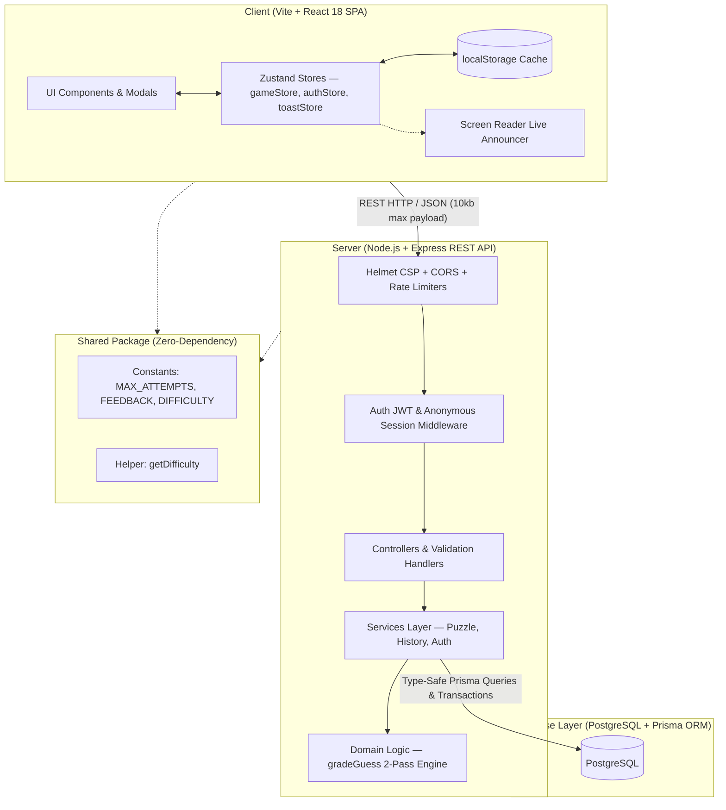
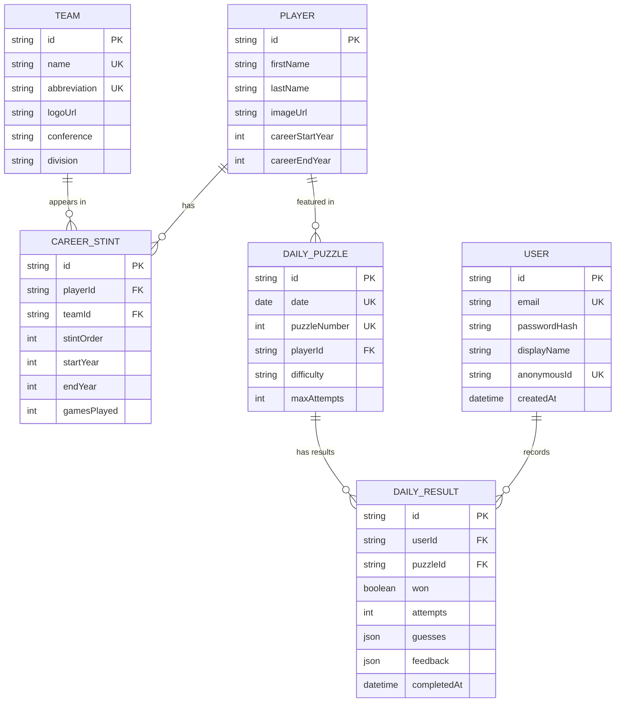
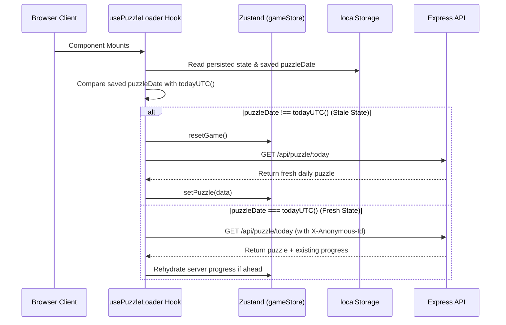
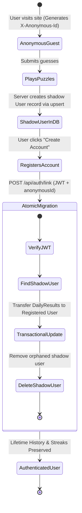

# JourneyMan — Architecture & System Design Blueprint

This document details the software architecture, design principles, mathematical algorithms, data models, and production hardening strategies of **JourneyMan**.

---

## Table of Contents

1. [System Topology & Monorepo Architecture](#1-system-topology--monorepo-architecture)
2. [Data Pipeline & Relational Schema](#2-data-pipeline--relational-schema)
3. [Constrained Random Daily Puzzle Generation Engine](#3-constrained-random-daily-puzzle-generation-engine)
4. [Duplicate-Aware Timeline Grading Engine](#4-duplicate-aware-timeline-grading-engine)
5. [Client State Architecture & UTC Date Rollover](#5-client-state-architecture--utc-date-rollover)
6. [Dual-Mode Authentication & Shadow User Migration Lifecycle](#6-dual-mode-authentication--shadow-user-migration-lifecycle)
7. [UI/UX Design System, Micro-Animations & Accessibility](#7-uiux-design-system-micro-animations--accessibility)
8. [Security Hardening & Production Reliability](#8-security-hardening--production-reliability)

---

## 1. System Topology & Monorepo Architecture

JourneyMan is architected as a **three-tier monorepo application** utilizing npm workspaces (`client`, `server`, `shared`).



### Component Layer Responsibilities

| Layer | Technology | Primary Responsibilities |
|-------|------------|--------------------------|
| **Frontend SPA** | React 18, Tailwind CSS, Framer Motion, Radix UI | User interaction, team search combobox, keyboard navigation, tile animations, client-side rehydration. |
| **State Management** | Zustand (`persist` middleware) | Reactive game state, authentication credentials, cached moves, toast alerts. |
| **Backend API** | Express 4, Node.js 18+ | Zero-trust guess grading, daily puzzle distribution, JWT issuance, play history analytics. |
| **Domain Logic** | Pure JavaScript | Mathematical 2-pass Wordle algorithm, difficulty classification. Zero external dependencies. |
| **Data Access** | Prisma ORM 5, PostgreSQL | Schema definitions, migrations, relational queries, transactional account linking. |
| **Shared Workspace** | ES Modules | Shared game constants (`MAX_ATTEMPTS = 6`, `DIFFICULTY`, `FEEDBACK`). Single source of truth. |

---

## 2. Data Pipeline & Relational Schema

### 2A. Career Stint Definition

A **career stint** represents a contiguous chronological tenure that an NBA player spent with a single franchise, where they participated in at least one regular season game (`gamesPlayed >= 1`).

- **Returning Players**: If a player leaves a franchise and returns in a later season (e.g. LeBron James: Cavaliers → Heat → Cavaliers → Lakers), that tenure is recorded as **two distinct stints** (Stint 1: CLE, Stint 3: CLE).
- **Puzzle Length**: The number of stints directly defines the puzzle's slot length and difficulty tier.

```
LeBron James Career Stints:
┌────────────────────┬───────────┬───────────┬─────────────┐
│ Stint Order        │ Team      │ Years     │ Games       │
├────────────────────┼───────────┼───────────┼─────────────┤
│ 1                  │ CLE       │ 2003–2010 │ 548         │
│ 2                  │ MIA       │ 2010–2014 │ 294         │
│ 3                  │ CLE       │ 2014–2018 │ 301         │
│ 4                  │ LAL       │ 2018–2026 │ 352         │
└────────────────────┴───────────┴───────────┴─────────────┘
-> Puzzle Answer: [CLE, MIA, CLE, LAL] (Length: 4 -> Hard Tier)
```

### 2B. Entity Relationship Model (ERD)



---

## 3. Constrained Random Daily Puzzle Generation Engine

To maintain long-term player engagement, daily puzzles must not feel repetitive or follow predictable difficulty streaks.

### 3A. Difficulty Classification

Difficulty is deterministically derived from the player's career stint count:

$$\text{Difficulty}(s) = \begin{cases} 
\text{Easy} & \text{if } s \le 2 \\
\text{Medium} & \text{if } s = 3 \\
\text{Hard} & \text{if } 4 \le s \le 5 \\
\text{Expert} & \text{if } s \ge 6 
\end{cases}$$

### 3B. Constraint Satisfaction Algorithm

The puzzle generation pipeline (`scripts/generate-puzzles.js`) implements a constrained random scheduling algorithm:

1. **Bucket Partitioning**: All eligible players with $\ge 2$ stints are partitioned into 4 distinct difficulty buckets: $\mathcal{B}_{\text{easy}}, \mathcal{B}_{\text{medium}}, \mathcal{B}_{\text{hard}}, \mathcal{B}_{\text{expert}}$.
2. **Independent Shuffling**: Each bucket is shuffled using the Fisher-Yates algorithm.
3. **Non-Consecutive Difficulty Guarantee**:
   For any calendar day $d_i$ and previous day $d_{i-1}$:
   $$\text{Difficulty}(d_i) \ne \text{Difficulty}(d_{i-1})$$
4. **Player Reuse Cooldown**: A player cannot be selected again until at least 60 calendar days have elapsed.
5. **Deterministic Seeding**: Puzzles are pre-persisted in `DailyPuzzles` keyed by `@db.Date`.

---

## 4. Duplicate-Aware Timeline Grading Engine

The core game logic employs a **duplicate-aware 2-pass matching algorithm** adapted for franchise career stints.

### 4A. Two-Pass Wordle Algorithm

Given a guess sequence $G = [g_0, g_1, \dots, g_{n-1}]$ and canonical answer sequence $A = [a_0, a_1, \dots, a_{n-1}]$:

```javascript
export const FEEDBACK = {
  CORRECT: 'correct',     // 🟩
  MISPLACED: 'misplaced', // 🟨
  INCORRECT: 'incorrect', // ⬛
};

export function gradeGuess(guess, answer) {
  const n = answer.length;
  if (guess.length !== n) {
    throw new Error(`Guess length (${guess.length}) must match answer length (${n}).`);
  }

  const feedback = new Array(n).fill(null);
  const answerUsed = new Array(n).fill(false);

  // PASS 1: Exact positional matches (Green 🟩)
  for (let i = 0; i < n; i++) {
    if (guess[i] === answer[i]) {
      feedback[i] = FEEDBACK.CORRECT;
      answerUsed[i] = true;
    }
  }

  // PASS 2: Misplaced matches (Yellow 🟨) & Incorrect (Gray ⬛)
  for (let i = 0; i < n; i++) {
    if (feedback[i] !== null) continue;

    let matched = false;
    for (let j = 0; j < n; j++) {
      if (!answerUsed[j] && guess[i] === answer[j]) {
        feedback[i] = FEEDBACK.MISPLACED;
        answerUsed[j] = true;
        matched = true;
        break;
      }
    }

    if (!matched) {
      feedback[i] = FEEDBACK.INCORRECT;
    }
  }

  return feedback;
}
```

### 4B. Duplicate Disambiguation Proof

Consider an answer with duplicate stints: $A = [\text{CLE}, \text{MIA}, \text{CLE}, \text{LAL}]$:

| Scenario | Guess ($G$) | Pass 1 (Exact) | Pass 2 (Misplaced) | Result |
|----------|-------------|----------------|--------------------|--------|
| **Over-guessing duplicate** | $[\text{CLE}, \text{CLE}, \text{CLE}, \text{CLE}]$ | $g_0 \to a_0$ (🟩), $g_2 \to a_2$ (🟩) | $g_1, g_3$ find no unused $\text{CLE}$ | $[🟩, ⬛, 🟩, ⬛]$ |
| **Permuted duplicates** | $[\text{LAL}, \text{CLE}, \text{MIA}, \text{CLE}]$ | None match position | $g_0 \to a_3$ (🟨), $g_1 \to a_0$ (🟨), $g_2 \to a_1$ (🟨), $g_3 \to a_2$ (🟨) | $[🟨, 🟨, 🟨, 🟨]$ |
| **Partial match** | $[\text{BOS}, \text{MIA}, \text{GSW}, \text{LAL}]$ | $g_1 \to a_1$ (🟩), $g_3 \to a_3$ (🟩) | $g_0, g_2$ are not in $A$ | $[⬛, 🟩, ⬛, 🟩]$ |

---

## 5. Client State Architecture & UTC Date Rollover

### 5A. Zustand Store Topology

The frontend state is partitioned into three focused Zustand stores:
1. `gameStore`: Active puzzle metadata, current input slots, guess history, feedback matrix, game status (`'playing'`, `'won'`, `'lost'`), and revealed answer.
2. `authStore`: User identity (`User` object), JWT bearer token, and anonymous session ID (`X-Anonymous-Id`).
3. `toastStore`: Ephemeral UI notification queue with severity levels (`'warning'`, `'info'`, `'success'`, `'error'`).

### 5B. UTC Midnight Synchronization Lifecycle

The application enforces **UTC midnight** as the single canonical puzzle boundary:



---

## 6. Dual-Mode Authentication & Shadow User Migration Lifecycle

JourneyMan supports frictionless anonymous play while allowing users to preserve their gameplay history permanently.



### Transactional Migration Logic
The linking operation runs inside a single database transaction (`prisma.$transaction`):
1. Identifies all `DailyResult` rows associated with the `anonymousId`.
2. Re-points each `DailyResult.userId` to the newly authenticated `User.id`.
3. Resolves potential conflicts if the user played on multiple devices.
4. Deletes the transient shadow `User` record to prevent database bloat.

---

## 7. UI/UX Design System, Micro-Animations & Accessibility

### 7A. Design Tokens & Theme

Built with Tailwind CSS using a sports-inspired dark aesthetic:
- **Background**: Deep slate `bg-slate-950` with subtle radial glows.
- **Card Surfaces**: Translucent slate `bg-slate-900/80` with backdrop blur (`backdrop-blur-md`) and slate borders `border-slate-800`.
- **Accents**: Warm NBA hardwood amber `text-amber-500` / `bg-amber-500` and emerald green `text-emerald-400`.
- **Typography**: Outfit / Inter variable sans-serif font stack.

### 7B. Animation Pipeline (Framer Motion)

Tile reveals utilize spring physics and staggered delay sequences:
- **Reveal Flips**: Each tile in a submitted guess row flips on the Y-axis with a $150\text{ms}$ stagger (`delay: index * 0.15s`), transitioning from neutral slate to the graded feedback color.
- **Shake Animation**: If the user submits an incomplete row, the active row triggers a 4-cycle horizontal shake (`x: [-8, 8, -6, 6, 0]`) accompanied by a toast warning.
- **Victory Confetti**: Upon game victory, `canvas-confetti` releases a dynamic particle burst.

### 7C. WCAG 2.1 AA Accessibility Specification

1. **Global Keyboard Shortcuts**:
   - `1`–`9`: Open team selector for slot index $1$ to $N$.
   - `Enter`: Submit the current guess.
   - `Backspace`: Remove team from the last filled slot.
   - `C` / `c`: Clear all un-locked slots.
   - `?` or `/`: Open "How to Play" rules modal.
   - `H` / `h`: Open "History & Stats" calendar modal.
2. **Screen Reader Live Region**: A visually hidden `aria-live="polite"` region announces slot selection changes, validation errors, and guess reveal feedback.
3. **Focus Management**: All interactive dialogs (Auth, History, Rules, Team Selector) trap focus and restore previous focus on dismissal.

---

## 8. Security Hardening & Production Reliability

### 8A. Multi-Tiered Rate Limiting

Rate limiting is enforced at the network layer using `express-rate-limit`:

| Route Pattern | Window | Max Requests | Target Threat |
|---------------|--------|--------------|---------------|
| `/api/*` | 15 minutes | 300 / IP | General DoS / API flooding |
| `/api/auth/*` | 15 minutes | 15 / IP | Password brute-force & credential stuffing |
| `/api/puzzle/guess` | 1 minute | 45 / IP | Guess automation & rapid submission spam |

*Note: Rate limiters are automatically bypassed in test environments (`NODE_ENV === 'test'`).*

### 8B. Security Headers (Helmet)

Helmet is configured with a strict Content Security Policy (CSP):
- **Image Sources (`img-src`)**: `'self'`, `data:`, `blob:`, `https://upload.wikimedia.org`, `https://*.wikimedia.org`, `https://*.nba.com`.
- **Script Sources (`script-src`)**: `'self'`.
- **Style Sources (`style-src`)**: `'self'`, `'unsafe-inline'` (required for Framer Motion dynamic CSS transforms).
- **Object Sources (`object-src`)**: `'none'`.
- **Frameguard**: `X-Frame-Options: SAMEORIGIN` (mitigates clickjacking).
- **MIME Sniffing**: `X-Content-Type-Options: nosniff`.

### 8C. Payload Protection & Error Masking

- **Payload Size Limit**: `express.json({ limit: '10kb' })` rejects oversized request bodies with HTTP `413 Payload Too Large`.
- **Error Masking**: The global error handler strictly isolates error messages:
  - Client errors ($4xx$) preserve readable validation feedback.
  - Server errors ($5xx$) are sanitized to `'Internal server error.'` in production, preventing internal Prisma/SQL schema leaks.
- **Graceful Shutdown**: `SIGTERM` and `SIGINT` lifecycle signals gracefully terminate active HTTP connections, wait for in-flight requests, and disconnect the Prisma database client (`prisma.$disconnect()`).
